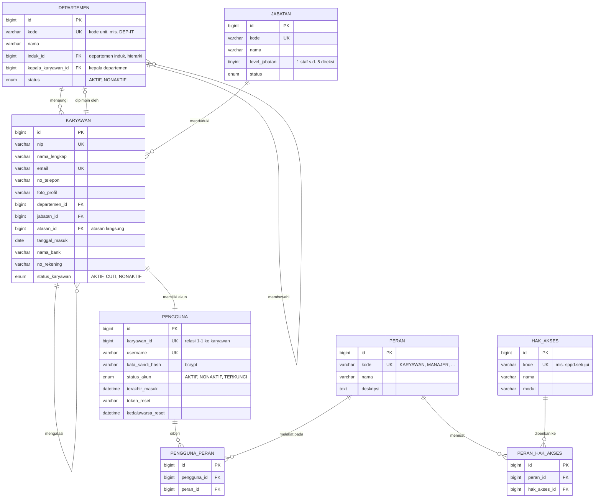
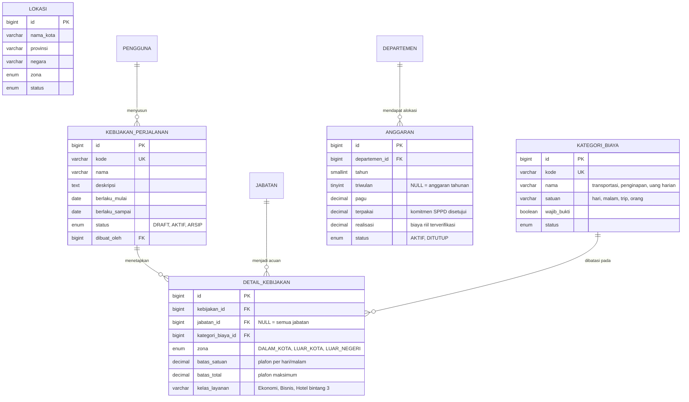
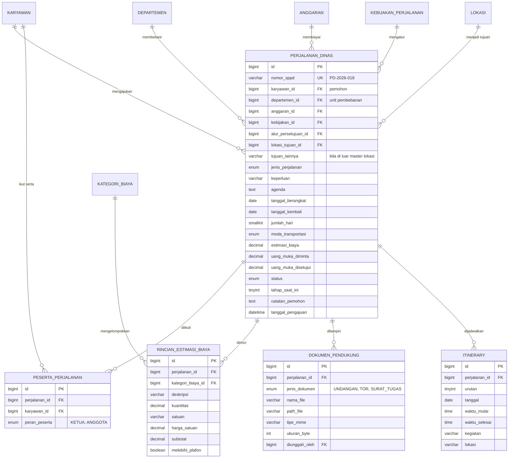
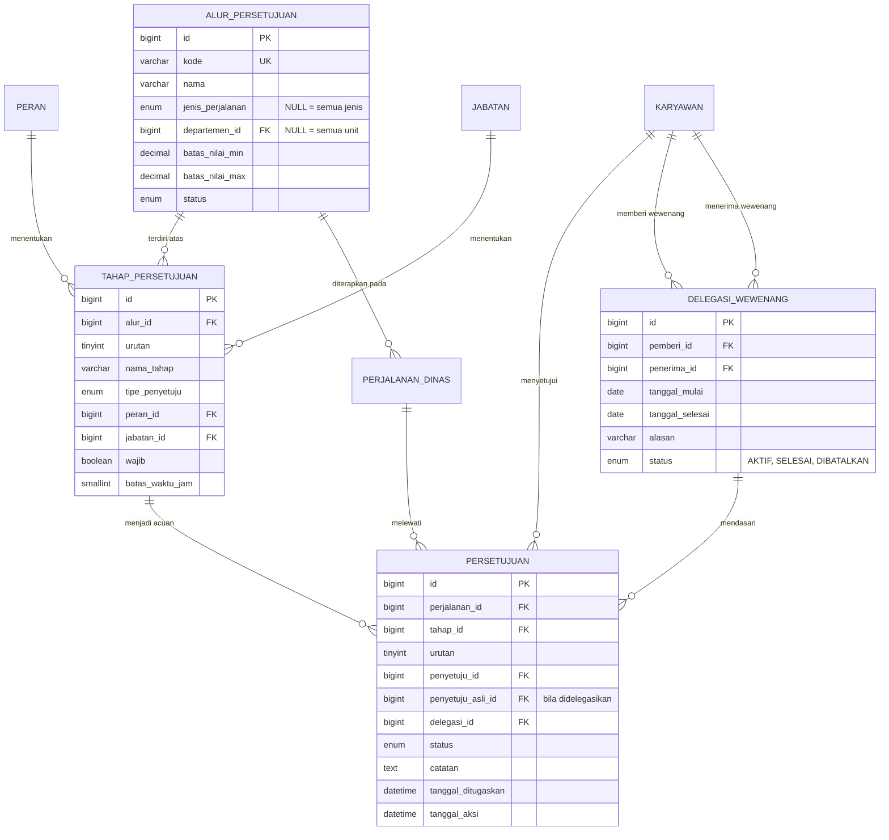
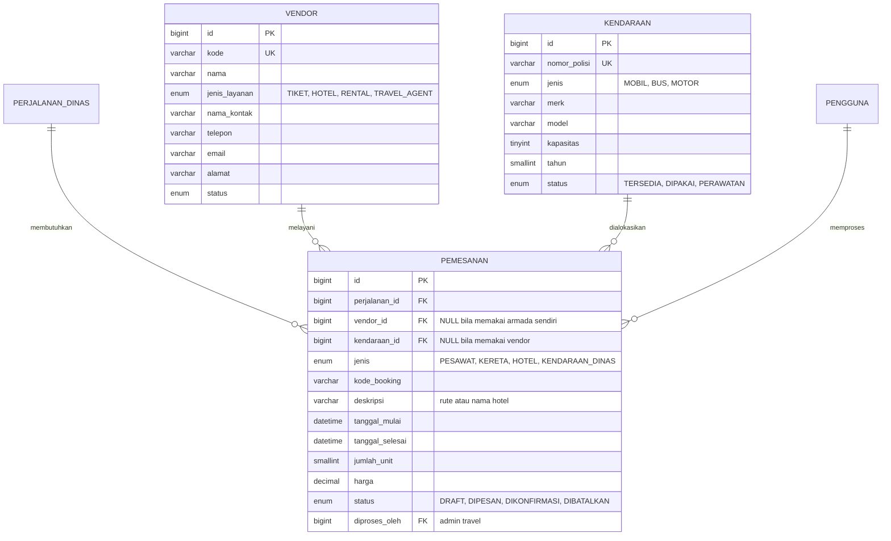
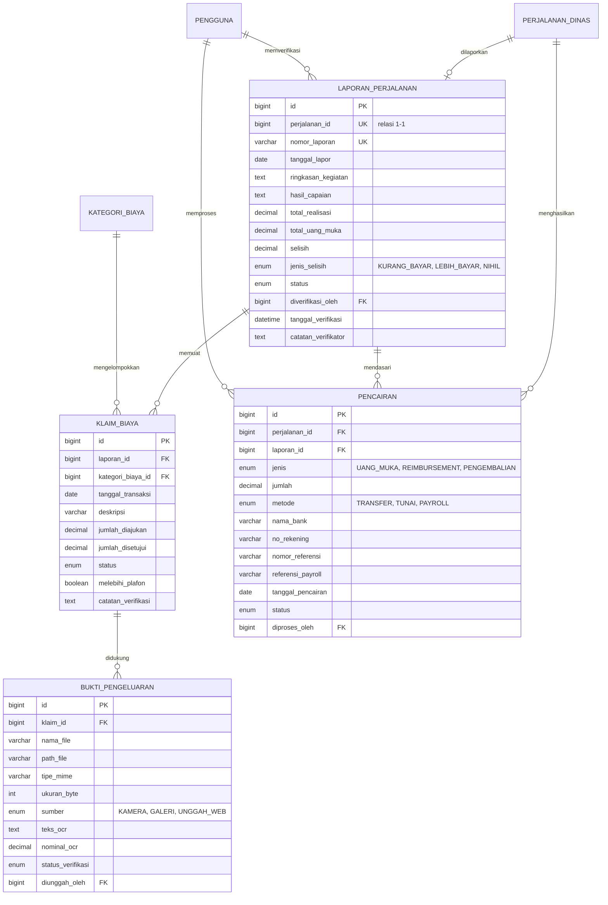
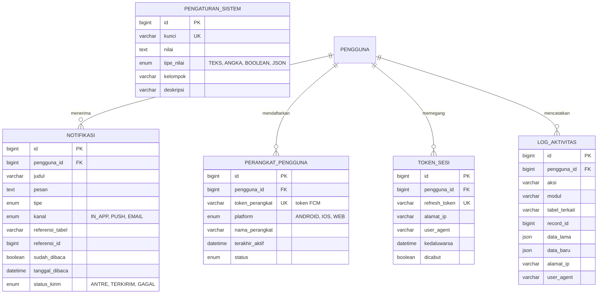

# ERD — Sistem Informasi Perjalanan Dinas (Web & Mobile)

**PT. Citra Mandiri — Kelompok 5**
Dokumen perancangan basis data berdasarkan *Proposal Kegiatan Perencanaan Rancangan Membangun Sistem Perjalanan Dinas (Web & Mobile)*.

| Item | Keterangan |
| --- | --- |
| DBMS | MySQL 8.x |
| Engine | InnoDB (mendukung *foreign key* & transaksi) |
| Charset / Collation | `utf8mb4` / `utf8mb4_unicode_ci` |
| Jumlah tabel | 34 tabel (30 inti Fase 1 + 4 tabel Booking & Fulfillment Fase 2) |
| Versi dokumen | 1.0 — 10 Agustus 2026 |

---

## Daftar Isi

1. [Konvensi Perancangan](#1-konvensi-perancangan)
2. [Peta Relasi Global](#2-peta-relasi-global)
3. [Modul A — Pengguna & Organisasi](#3-modul-a--pengguna--organisasi)
4. [Modul B — Kebijakan & Anggaran](#4-modul-b--kebijakan--anggaran)
5. [Modul C — Pengajuan SPPD](#5-modul-c--pengajuan-sppd)
6. [Modul D — Persetujuan (Approval Workflow)](#6-modul-d--persetujuan-approval-workflow)
7. [Modul E — Booking & Fulfillment (Fase 2)](#7-modul-e--booking--fulfillment-fase-2)
8. [Modul F — Pelaporan & Reimbursement](#8-modul-f--pelaporan--reimbursement)
9. [Modul G — Sistem, Notifikasi & Audit](#9-modul-g--sistem-notifikasi--audit)
10. [Daftar Enumerasi](#10-daftar-enumerasi)
11. [Aturan Bisnis & Integritas Data](#11-aturan-bisnis--integritas-data)
12. [Rekomendasi Indeks](#12-rekomendasi-indeks)
13. [Pemetaan Modul Proposal ke Tabel](#13-pemetaan-modul-proposal-ke-tabel)

---

## 1. Konvensi Perancangan

**Penamaan**

- Nama tabel: `snake_case`, bahasa Indonesia, bentuk tunggal (`perjalanan_dinas`, `klaim_biaya`).
- Tabel relasi banyak-ke-banyak: gabungan nama kedua tabel (`pengguna_peran`, `peran_hak_akses`).
- Primary key selalu bernama `id`, bertipe `BIGINT UNSIGNED AUTO_INCREMENT`.
- Foreign key mengikuti pola `<tabel_tujuan>_id`. Bila satu tabel dirujuk lebih dari sekali, diberi awalan peran (`atasan_id`, `penyetuju_id`, `diproses_oleh`).
- Kolom boolean diawali `is_`/kata sifat (`wajib_bukti`, `sudah_dibaca`, `dicabut`).

**Kolom audit standar** — dimiliki **seluruh tabel**, karena itu tidak diulang pada kamus data maupun diagram:

| Kolom | Tipe | Keterangan |
| --- | --- | --- |
| `dibuat_pada` | `DATETIME` | Diisi otomatis saat baris dibuat. |
| `diubah_pada` | `DATETIME` | Diperbarui otomatis saat baris berubah. |
| `dihapus_pada` | `DATETIME NULL` | *Soft delete*; baris dengan nilai terisi diabaikan aplikasi. |

**Tipe data yang dipakai**

| Kebutuhan | Tipe MySQL | Alasan |
| --- | --- | --- |
| Nilai uang | `DECIMAL(15,2)` — agregat `DECIMAL(18,2)` | Menghindari galat pembulatan `FLOAT` pada perhitungan biaya. |
| Tanggal saja | `DATE` | Tanggal berangkat/kembali/transaksi. |
| Tanggal + waktu | `DATETIME` | Waktu aksi persetujuan, pengiriman notifikasi. |
| Status terbatas | `ENUM` | Nilai baku, hemat ruang, tervalidasi di level basis data. |
| Data tak terstruktur | `JSON` | Snapshot data lama/baru pada log audit. |
| Berkas | `VARCHAR(255)` berisi path | Berkas fisik disimpan di storage/cloud, bukan sebagai BLOB. |

**Aturan referensial umum**

- Data master (`departemen`, `jabatan`, `kategori_biaya`, `lokasi`, `vendor`) memakai `ON DELETE RESTRICT` — tidak boleh dihapus bila masih dirujuk transaksi. Penonaktifan dilakukan lewat kolom `status`.
- Tabel detail yang tidak berarti tanpa induknya (`rincian_estimasi_biaya`, `klaim_biaya`, `bukti_pengeluaran`, `itinerary`, `peserta_perjalanan`) memakai `ON DELETE CASCADE`.
- Kolom `ON UPDATE CASCADE` diterapkan pada seluruh foreign key.

---

## 2. Peta Relasi Global

Diagram berikut menampilkan seluruh entitas beserta kardinalitasnya tanpa atribut, sebagai gambaran menyeluruh. Detail atribut tiap entitas ada pada diagram per modul di bagian berikutnya.

```mermaid
erDiagram
    DEPARTEMEN ||--o{ DEPARTEMEN : "membawahi"
    DEPARTEMEN ||--o{ KARYAWAN : "menaungi"
    JABATAN ||--o{ KARYAWAN : "menduduki"
    KARYAWAN ||--o{ KARYAWAN : "mengatasi"
    KARYAWAN ||--|| PENGGUNA : "memiliki akun"
    PENGGUNA ||--o{ PENGGUNA_PERAN : "diberi"
    PERAN ||--o{ PENGGUNA_PERAN : "melekat pada"
    PERAN ||--o{ PERAN_HAK_AKSES : "memuat"
    HAK_AKSES ||--o{ PERAN_HAK_AKSES : "diberikan ke"

    KEBIJAKAN_PERJALANAN ||--o{ DETAIL_KEBIJAKAN : "menetapkan"
    JABATAN ||--o{ DETAIL_KEBIJAKAN : "menjadi acuan"
    KATEGORI_BIAYA ||--o{ DETAIL_KEBIJAKAN : "dibatasi pada"
    DEPARTEMEN ||--o{ ANGGARAN : "mendapat alokasi"

    KARYAWAN ||--o{ PERJALANAN_DINAS : "mengajukan"
    DEPARTEMEN ||--o{ PERJALANAN_DINAS : "membebani"
    ANGGARAN ||--o{ PERJALANAN_DINAS : "membiayai"
    KEBIJAKAN_PERJALANAN ||--o{ PERJALANAN_DINAS : "mengatur"
    LOKASI ||--o{ PERJALANAN_DINAS : "menjadi tujuan"
    PERJALANAN_DINAS ||--o{ PESERTA_PERJALANAN : "diikuti"
    KARYAWAN ||--o{ PESERTA_PERJALANAN : "ikut serta"
    PERJALANAN_DINAS ||--o{ RINCIAN_ESTIMASI_BIAYA : "dirinci"
    KATEGORI_BIAYA ||--o{ RINCIAN_ESTIMASI_BIAYA : "mengelompokkan"
    PERJALANAN_DINAS ||--o{ DOKUMEN_PENDUKUNG : "dilampiri"
    PERJALANAN_DINAS ||--o{ ITINERARY : "dijadwalkan"

    ALUR_PERSETUJUAN ||--o{ TAHAP_PERSETUJUAN : "terdiri atas"
    ALUR_PERSETUJUAN ||--o{ PERJALANAN_DINAS : "diterapkan pada"
    PERJALANAN_DINAS ||--o{ PERSETUJUAN : "melewati"
    TAHAP_PERSETUJUAN ||--o{ PERSETUJUAN : "menjadi acuan"
    KARYAWAN ||--o{ PERSETUJUAN : "menyetujui"
    KARYAWAN ||--o{ DELEGASI_WEWENANG : "mendelegasikan"
    DELEGASI_WEWENANG ||--o{ PERSETUJUAN : "mendasari"

    PERJALANAN_DINAS ||--o{ PEMESANAN : "membutuhkan"
    VENDOR ||--o{ PEMESANAN : "melayani"
    KENDARAAN ||--o{ PEMESANAN : "dialokasikan"

    PERJALANAN_DINAS ||--o| LAPORAN_PERJALANAN : "dilaporkan"
    LAPORAN_PERJALANAN ||--o{ KLAIM_BIAYA : "memuat"
    KATEGORI_BIAYA ||--o{ KLAIM_BIAYA : "mengelompokkan"
    KLAIM_BIAYA ||--o{ BUKTI_PENGELUARAN : "didukung"
    PERJALANAN_DINAS ||--o{ PENCAIRAN : "menghasilkan"
    LAPORAN_PERJALANAN ||--o{ PENCAIRAN : "mendasari"

    PENGGUNA ||--o{ NOTIFIKASI : "menerima"
    PENGGUNA ||--o{ PERANGKAT_PENGGUNA : "mendaftarkan"
    PENGGUNA ||--o{ TOKEN_SESI : "memegang"
    PENGGUNA ||--o{ LOG_AKTIVITAS : "mencatatkan"
```

---

## 3. Modul A — Pengguna & Organisasi

Menjawab kebutuhan **"Manajemen Pengguna & Otorisasi"** dan tugas **Super Admin** (mengelola data master karyawan serta otorisasi hak akses).

Data kepegawaian (`karyawan`) dipisahkan dari data akun (`pengguna`) dengan relasi satu-ke-satu. Pemisahan ini membuat karyawan tetap tercatat sebagai entitas organisasi meski akun aplikasinya dinonaktifkan, dan menjaga data autentikasi terisolasi dari data profil.

### 3.1 `departemen`

Struktur organisasi/divisi, sekaligus unit pembebanan anggaran perjalanan dinas.

| Kolom | Tipe | Kunci | Null | Keterangan |
| --- | --- | --- | --- | --- |
| `id` | `BIGINT UNSIGNED` | PK | Tidak | |
| `kode` | `VARCHAR(20)` | UK | Tidak | Kode unit, contoh `DEP-FIN`. |
| `nama` | `VARCHAR(100)` | | Tidak | Nama departemen/divisi. |
| `induk_id` | `BIGINT UNSIGNED` | FK → `departemen.id` | Ya | Relasi rekursif untuk struktur bertingkat. `NULL` = unit puncak. |
| `kepala_karyawan_id` | `BIGINT UNSIGNED` | FK → `karyawan.id` | Ya | Dipakai alur persetujuan tipe `KEPALA_DEPARTEMEN`. |
| `status` | `ENUM('AKTIF','NONAKTIF')` | | Tidak | Default `AKTIF`. |

### 3.2 `jabatan`

| Kolom | Tipe | Kunci | Null | Keterangan |
| --- | --- | --- | --- | --- |
| `id` | `BIGINT UNSIGNED` | PK | Tidak | |
| `kode` | `VARCHAR(20)` | UK | Tidak | |
| `nama` | `VARCHAR(100)` | | Tidak | Contoh: Staf, Koordinator, Manajer. |
| `level_jabatan` | `TINYINT UNSIGNED` | | Tidak | 1–5. Menentukan plafon biaya pada `detail_kebijakan` dan jenjang persetujuan. |
| `status` | `ENUM('AKTIF','NONAKTIF')` | | Tidak | |

### 3.3 `karyawan`

| Kolom | Tipe | Kunci | Null | Keterangan |
| --- | --- | --- | --- | --- |
| `id` | `BIGINT UNSIGNED` | PK | Tidak | |
| `nip` | `VARCHAR(30)` | UK | Tidak | Nomor induk pegawai. |
| `nama_lengkap` | `VARCHAR(120)` | | Tidak | |
| `email` | `VARCHAR(120)` | UK | Tidak | Tujuan notifikasi email. |
| `no_telepon` | `VARCHAR(20)` | | Ya | |
| `foto_profil` | `VARCHAR(255)` | | Ya | Path berkas foto. |
| `departemen_id` | `BIGINT UNSIGNED` | FK → `departemen.id` | Tidak | |
| `jabatan_id` | `BIGINT UNSIGNED` | FK → `jabatan.id` | Tidak | |
| `atasan_id` | `BIGINT UNSIGNED` | FK → `karyawan.id` | Ya | Relasi rekursif; dasar persetujuan tipe `ATASAN_LANGSUNG`. |
| `tanggal_masuk` | `DATE` | | Ya | |
| `nama_bank` | `VARCHAR(50)` | | Ya | Untuk pencairan uang muka/reimbursement. |
| `no_rekening` | `VARCHAR(40)` | | Ya | |
| `nama_pemilik_rekening` | `VARCHAR(120)` | | Ya | |
| `status_karyawan` | `ENUM('AKTIF','CUTI','NONAKTIF')` | | Tidak | Status `CUTI` memicu pemeriksaan `delegasi_wewenang`. |

### 3.4 `pengguna`

| Kolom | Tipe | Kunci | Null | Keterangan |
| --- | --- | --- | --- | --- |
| `id` | `BIGINT UNSIGNED` | PK | Tidak | |
| `karyawan_id` | `BIGINT UNSIGNED` | FK → `karyawan.id`, UK | Tidak | Unik agar relasi tetap satu-ke-satu. |
| `username` | `VARCHAR(50)` | UK | Tidak | |
| `kata_sandi_hash` | `VARCHAR(255)` | | Tidak | Hash bcrypt; kata sandi asli tidak pernah disimpan. |
| `status_akun` | `ENUM('AKTIF','NONAKTIF','TERKUNCI')` | | Tidak | `TERKUNCI` setelah percobaan masuk gagal berulang. |
| `terakhir_masuk` | `DATETIME` | | Ya | |
| `token_reset` | `VARCHAR(255)` | | Ya | Token lupa kata sandi. |
| `kedaluwarsa_reset` | `DATETIME` | | Ya | |

### 3.5 `peran`

Lima peran sesuai proposal: `KARYAWAN`, `MANAJER`, `ADMIN_TRAVEL`, `KEUANGAN`, `SUPER_ADMIN`.

| Kolom | Tipe | Kunci | Null | Keterangan |
| --- | --- | --- | --- | --- |
| `id` | `BIGINT UNSIGNED` | PK | Tidak | |
| `kode` | `VARCHAR(30)` | UK | Tidak | |
| `nama` | `VARCHAR(60)` | | Tidak | Label tampilan. |
| `deskripsi` | `TEXT` | | Ya | |

### 3.6 `pengguna_peran`

Relasi banyak-ke-banyak. Satu pengguna dapat memegang lebih dari satu peran (contoh: seorang manajer yang juga mengajukan perjalanan dinas untuk dirinya sendiri).

| Kolom | Tipe | Kunci | Null | Keterangan |
| --- | --- | --- | --- | --- |
| `id` | `BIGINT UNSIGNED` | PK | Tidak | |
| `pengguna_id` | `BIGINT UNSIGNED` | FK → `pengguna.id` | Tidak | Unik gabungan dengan `peran_id`. |
| `peran_id` | `BIGINT UNSIGNED` | FK → `peran.id` | Tidak | |

### 3.7 `hak_akses`

| Kolom | Tipe | Kunci | Null | Keterangan |
| --- | --- | --- | --- | --- |
| `id` | `BIGINT UNSIGNED` | PK | Tidak | |
| `kode` | `VARCHAR(60)` | UK | Tidak | Format `modul.aksi`, contoh `sppd.setujui`, `laporan.ekspor`. |
| `nama` | `VARCHAR(100)` | | Tidak | |
| `modul` | `VARCHAR(40)` | | Tidak | Pengelompokan pada halaman pengaturan hak akses. |

### 3.8 `peran_hak_akses`

| Kolom | Tipe | Kunci | Null | Keterangan |
| --- | --- | --- | --- | --- |
| `id` | `BIGINT UNSIGNED` | PK | Tidak | |
| `peran_id` | `BIGINT UNSIGNED` | FK → `peran.id` | Tidak | Unik gabungan dengan `hak_akses_id`. |
| `hak_akses_id` | `BIGINT UNSIGNED` | FK → `hak_akses.id` | Tidak | |

---

## 4. Modul B — Kebijakan & Anggaran

Menjawab kebutuhan **"Integrasi dengan kebijakan perusahaan (Travel Policy)"** dan **"Manajemen Anggaran (Budgeting): pengaturan alokasi dana per divisi/departemen"**.

Kebijakan dipecah menjadi induk (`kebijakan_perjalanan`, berisi masa berlaku) dan detail (`detail_kebijakan`, berisi plafon per kombinasi jabatan × kategori biaya × zona). Dengan struktur ini, perubahan plafon cukup menerbitkan kebijakan versi baru tanpa mengubah struktur tabel maupun data historis.

### 4.1 `kategori_biaya`

Master komponen biaya: transportasi, penginapan, uang harian (*per diem*), konsumsi, dokumen/visa, lain-lain.

| Kolom | Tipe | Kunci | Null | Keterangan |
| --- | --- | --- | --- | --- |
| `id` | `BIGINT UNSIGNED` | PK | Tidak | |
| `kode` | `VARCHAR(20)` | UK | Tidak | Contoh `TRANSPORT`, `PENGINAPAN`. |
| `nama` | `VARCHAR(80)` | | Tidak | |
| `satuan` | `VARCHAR(20)` | | Tidak | `hari`, `malam`, `trip`, `orang`. |
| `wajib_bukti` | `BOOLEAN` | | Tidak | Bila `TRUE`, klaim kategori ini wajib melampirkan nota. Uang harian umumnya `FALSE`. |
| `status` | `ENUM('AKTIF','NONAKTIF')` | | Tidak | |

### 4.2 `lokasi`

| Kolom | Tipe | Kunci | Null | Keterangan |
| --- | --- | --- | --- | --- |
| `id` | `BIGINT UNSIGNED` | PK | Tidak | |
| `nama_kota` | `VARCHAR(80)` | | Tidak | |
| `provinsi` | `VARCHAR(80)` | | Ya | |
| `negara` | `VARCHAR(60)` | | Tidak | Default `Indonesia`. |
| `zona` | `ENUM('DALAM_KOTA','LUAR_KOTA','LUAR_NEGERI')` | | Tidak | Penentu plafon biaya yang berlaku. |
| `status` | `ENUM('AKTIF','NONAKTIF')` | | Tidak | |

### 4.3 `kebijakan_perjalanan`

| Kolom | Tipe | Kunci | Null | Keterangan |
| --- | --- | --- | --- | --- |
| `id` | `BIGINT UNSIGNED` | PK | Tidak | |
| `kode` | `VARCHAR(30)` | UK | Tidak | Contoh `POL-2026-01`. |
| `nama` | `VARCHAR(120)` | | Tidak | |
| `deskripsi` | `TEXT` | | Ya | |
| `berlaku_mulai` | `DATE` | | Tidak | |
| `berlaku_sampai` | `DATE` | | Ya | `NULL` = berlaku sampai dicabut. |
| `status` | `ENUM('DRAFT','AKTIF','ARSIP')` | | Tidak | Hanya satu kebijakan `AKTIF` pada satu rentang waktu. |
| `dibuat_oleh` | `BIGINT UNSIGNED` | FK → `pengguna.id` | Tidak | Super Admin penyusun kebijakan. |

### 4.4 `detail_kebijakan`

| Kolom | Tipe | Kunci | Null | Keterangan |
| --- | --- | --- | --- | --- |
| `id` | `BIGINT UNSIGNED` | PK | Tidak | |
| `kebijakan_id` | `BIGINT UNSIGNED` | FK → `kebijakan_perjalanan.id` | Tidak | |
| `jabatan_id` | `BIGINT UNSIGNED` | FK → `jabatan.id` | Ya | `NULL` = berlaku untuk semua jabatan. |
| `kategori_biaya_id` | `BIGINT UNSIGNED` | FK → `kategori_biaya.id` | Tidak | |
| `zona` | `ENUM('DALAM_KOTA','LUAR_KOTA','LUAR_NEGERI')` | | Tidak | |
| `batas_satuan` | `DECIMAL(15,2)` | | Tidak | Plafon per satuan, mis. Rp750.000/malam. |
| `batas_total` | `DECIMAL(15,2)` | | Ya | Plafon maksimum satu perjalanan. |
| `kelas_layanan` | `VARCHAR(40)` | | Ya | Contoh `Ekonomi`, `Bisnis`, `Hotel bintang 3`. |
| `keterangan` | `VARCHAR(200)` | | Ya | |

> Kombinasi `kebijakan_id` + `jabatan_id` + `kategori_biaya_id` + `zona` bersifat unik.

### 4.5 `anggaran`

| Kolom | Tipe | Kunci | Null | Keterangan |
| --- | --- | --- | --- | --- |
| `id` | `BIGINT UNSIGNED` | PK | Tidak | |
| `departemen_id` | `BIGINT UNSIGNED` | FK → `departemen.id` | Tidak | |
| `tahun` | `SMALLINT UNSIGNED` | | Tidak | |
| `triwulan` | `TINYINT UNSIGNED` | | Ya | 1–4; `NULL` = alokasi tahunan. |
| `pagu` | `DECIMAL(18,2)` | | Tidak | Alokasi dana perjalanan dinas. |
| `terpakai` | `DECIMAL(18,2)` | | Tidak | Akumulasi estimasi biaya SPPD yang sudah disetujui (komitmen). |
| `realisasi` | `DECIMAL(18,2)` | | Tidak | Akumulasi biaya riil dari laporan terverifikasi. |
| `status` | `ENUM('AKTIF','DITUTUP')` | | Tidak | |

> Kombinasi `departemen_id` + `tahun` + `triwulan` bersifat unik. Sisa anggaran dihitung `pagu - terpakai`, tidak disimpan sebagai kolom agar tidak terjadi data ganda.

---

## 5. Modul C — Pengajuan SPPD

Menjawab **Modul Pengajuan (Request)**: formulir digital tujuan/tanggal/agenda/estimasi biaya, riwayat perjalanan, dan unggah dokumen pendukung (undangan, TOR).

`perjalanan_dinas` adalah entitas pusat sistem — hampir seluruh modul lain merujuk ke sini.

### 5.1 `perjalanan_dinas`

| Kolom | Tipe | Kunci | Null | Keterangan |
| --- | --- | --- | --- | --- |
| `id` | `BIGINT UNSIGNED` | PK | Tidak | |
| `nomor_sppd` | `VARCHAR(30)` | UK | Tidak | Dibuat otomatis, format `PD-<tahun>-<urut>` — mengikuti prototipe antarmuka. |
| `karyawan_id` | `BIGINT UNSIGNED` | FK → `karyawan.id` | Tidak | Pemohon utama. |
| `departemen_id` | `BIGINT UNSIGNED` | FK → `departemen.id` | Tidak | Disalin saat pengajuan agar riwayat tetap benar walau karyawan pindah unit. |
| `anggaran_id` | `BIGINT UNSIGNED` | FK → `anggaran.id` | Ya | Pos anggaran yang dibebani. |
| `kebijakan_id` | `BIGINT UNSIGNED` | FK → `kebijakan_perjalanan.id` | Ya | Kebijakan yang berlaku saat pengajuan dibuat. |
| `alur_persetujuan_id` | `BIGINT UNSIGNED` | FK → `alur_persetujuan.id` | Ya | Alur yang dipilih sistem berdasarkan jenis & nilai perjalanan. |
| `lokasi_tujuan_id` | `BIGINT UNSIGNED` | FK → `lokasi.id` | Ya | |
| `tujuan_lainnya` | `VARCHAR(120)` | | Ya | Diisi bila tujuan belum ada pada master lokasi. |
| `jenis_perjalanan` | `ENUM('DALAM_KOTA','LUAR_KOTA','LUAR_NEGERI')` | | Tidak | |
| `keperluan` | `VARCHAR(200)` | | Tidak | Judul singkat kegiatan. |
| `agenda` | `TEXT` | | Ya | Uraian rinci keperluan. |
| `tanggal_berangkat` | `DATE` | | Tidak | |
| `tanggal_kembali` | `DATE` | | Tidak | Wajib ≥ `tanggal_berangkat`. |
| `jumlah_hari` | `SMALLINT UNSIGNED` | | Tidak | Nilai turunan, disimpan untuk mempercepat pelaporan. |
| `moda_transportasi` | `ENUM(...)` | | Tidak | Lihat [Daftar Enumerasi](#10-daftar-enumerasi). |
| `estimasi_biaya` | `DECIMAL(15,2)` | | Tidak | Total dari `rincian_estimasi_biaya`. |
| `uang_muka_diminta` | `DECIMAL(15,2)` | | Tidak | Default `0`. |
| `uang_muka_disetujui` | `DECIMAL(15,2)` | | Tidak | Ditetapkan Tim Keuangan; dasar perhitungan selisih. |
| `status` | `ENUM(...)` | | Tidak | Lihat `status_pengajuan`. |
| `tahap_saat_ini` | `TINYINT UNSIGNED` | | Tidak | Urutan tahap persetujuan yang sedang berjalan; `0` bila masih draf. |
| `catatan_pemohon` | `TEXT` | | Ya | |
| `tanggal_pengajuan` | `DATETIME` | | Ya | Terisi saat status berpindah dari `DRAFT`. |
| `tanggal_selesai` | `DATETIME` | | Ya | Terisi saat laporan diverifikasi. |

### 5.2 `peserta_perjalanan`

Mendukung perjalanan rombongan: satu SPPD diikuti beberapa karyawan.

| Kolom | Tipe | Kunci | Null | Keterangan |
| --- | --- | --- | --- | --- |
| `id` | `BIGINT UNSIGNED` | PK | Tidak | |
| `perjalanan_id` | `BIGINT UNSIGNED` | FK → `perjalanan_dinas.id` | Tidak | Unik gabungan dengan `karyawan_id`. |
| `karyawan_id` | `BIGINT UNSIGNED` | FK → `karyawan.id` | Tidak | |
| `peran_peserta` | `ENUM('KETUA','ANGGOTA')` | | Tidak | |
| `keterangan` | `VARCHAR(150)` | | Ya | |

### 5.3 `rincian_estimasi_biaya`

| Kolom | Tipe | Kunci | Null | Keterangan |
| --- | --- | --- | --- | --- |
| `id` | `BIGINT UNSIGNED` | PK | Tidak | |
| `perjalanan_id` | `BIGINT UNSIGNED` | FK → `perjalanan_dinas.id` | Tidak | |
| `kategori_biaya_id` | `BIGINT UNSIGNED` | FK → `kategori_biaya.id` | Tidak | |
| `deskripsi` | `VARCHAR(150)` | | Ya | |
| `kuantitas` | `DECIMAL(8,2)` | | Tidak | Jumlah hari/malam/orang. |
| `satuan` | `VARCHAR(20)` | | Tidak | Disalin dari kategori biaya. |
| `harga_satuan` | `DECIMAL(15,2)` | | Tidak | |
| `subtotal` | `DECIMAL(15,2)` | | Tidak | `kuantitas × harga_satuan`. |
| `melebihi_plafon` | `BOOLEAN` | | Tidak | Ditandai sistem bila melampaui `detail_kebijakan`; menjadi sorotan bagi penyetuju. |

### 5.4 `dokumen_pendukung`

| Kolom | Tipe | Kunci | Null | Keterangan |
| --- | --- | --- | --- | --- |
| `id` | `BIGINT UNSIGNED` | PK | Tidak | |
| `perjalanan_id` | `BIGINT UNSIGNED` | FK → `perjalanan_dinas.id` | Tidak | |
| `jenis_dokumen` | `ENUM('UNDANGAN','TOR','SURAT_TUGAS','LAINNYA')` | | Tidak | |
| `nama_file` | `VARCHAR(150)` | | Tidak | Nama asli berkas. |
| `path_file` | `VARCHAR(255)` | | Tidak | Lokasi berkas pada penyimpanan. |
| `tipe_mime` | `VARCHAR(60)` | | Tidak | |
| `ukuran_byte` | `INT UNSIGNED` | | Tidak | Untuk validasi batas unggah. |
| `diunggah_oleh` | `BIGINT UNSIGNED` | FK → `pengguna.id` | Tidak | |

### 5.5 `itinerary`

Rencana kegiatan harian selama perjalanan; menjadi dasar fitur pemilihan itinerary pada Fase 2.

| Kolom | Tipe | Kunci | Null | Keterangan |
| --- | --- | --- | --- | --- |
| `id` | `BIGINT UNSIGNED` | PK | Tidak | |
| `perjalanan_id` | `BIGINT UNSIGNED` | FK → `perjalanan_dinas.id` | Tidak | |
| `urutan` | `TINYINT UNSIGNED` | | Tidak | Urutan tampil. |
| `tanggal` | `DATE` | | Tidak | Harus berada dalam rentang tanggal perjalanan. |
| `waktu_mulai` | `TIME` | | Ya | |
| `waktu_selesai` | `TIME` | | Ya | |
| `kegiatan` | `VARCHAR(200)` | | Tidak | |
| `lokasi` | `VARCHAR(150)` | | Ya | |

---

## 6. Modul D — Persetujuan (Approval Workflow)

Menjawab **Modul Persetujuan**: status transparan, *multi-level approval* (Manajer → Department Head → HRD/Finance), dan aturan delegasi wewenang saat atasan berhalangan.

Alur persetujuan dirancang **berbasis data, bukan tertanam pada program**: `alur_persetujuan` + `tahap_persetujuan` adalah cetak birunya, sedangkan `persetujuan` adalah jejak nyata per pengajuan. Dengan begitu penambahan jenjang persetujuan cukup lewat pengaturan, tanpa mengubah struktur basis data.

### 6.1 `alur_persetujuan`

| Kolom | Tipe | Kunci | Null | Keterangan |
| --- | --- | --- | --- | --- |
| `id` | `BIGINT UNSIGNED` | PK | Tidak | |
| `kode` | `VARCHAR(30)` | UK | Tidak | |
| `nama` | `VARCHAR(100)` | | Tidak | Contoh "Perjalanan Luar Kota di atas Rp5 juta". |
| `jenis_perjalanan` | `ENUM(...)` | | Ya | `NULL` = berlaku semua jenis. |
| `departemen_id` | `BIGINT UNSIGNED` | FK → `departemen.id` | Ya | `NULL` = berlaku semua unit. |
| `batas_nilai_min` | `DECIMAL(15,2)` | | Tidak | Default `0`. |
| `batas_nilai_max` | `DECIMAL(15,2)` | | Ya | `NULL` = tanpa batas atas. |
| `status` | `ENUM('AKTIF','NONAKTIF')` | | Tidak | |

### 6.2 `tahap_persetujuan`

| Kolom | Tipe | Kunci | Null | Keterangan |
| --- | --- | --- | --- | --- |
| `id` | `BIGINT UNSIGNED` | PK | Tidak | |
| `alur_id` | `BIGINT UNSIGNED` | FK → `alur_persetujuan.id` | Tidak | Unik gabungan dengan `urutan`. |
| `urutan` | `TINYINT UNSIGNED` | | Tidak | 1, 2, 3 … menentukan jenjang. |
| `nama_tahap` | `VARCHAR(60)` | | Tidak | Contoh "Persetujuan Manajer". |
| `tipe_penyetuju` | `ENUM('ATASAN_LANGSUNG','KEPALA_DEPARTEMEN','PERAN','JABATAN')` | | Tidak | Cara sistem menentukan penyetuju. |
| `peran_id` | `BIGINT UNSIGNED` | FK → `peran.id` | Ya | Diisi bila `tipe_penyetuju = PERAN`. |
| `jabatan_id` | `BIGINT UNSIGNED` | FK → `jabatan.id` | Ya | Diisi bila `tipe_penyetuju = JABATAN`. |
| `wajib` | `BOOLEAN` | | Tidak | Bila `FALSE`, tahap dapat dilewati otomatis. |
| `batas_waktu_jam` | `SMALLINT UNSIGNED` | | Ya | Dasar notifikasi pengingat bagi penyetuju. |

### 6.3 `persetujuan`

Satu baris per tahap per pengajuan — sekaligus menjadi riwayat *audit trail* proses persetujuan.

| Kolom | Tipe | Kunci | Null | Keterangan |
| --- | --- | --- | --- | --- |
| `id` | `BIGINT UNSIGNED` | PK | Tidak | |
| `perjalanan_id` | `BIGINT UNSIGNED` | FK → `perjalanan_dinas.id` | Tidak | |
| `tahap_id` | `BIGINT UNSIGNED` | FK → `tahap_persetujuan.id` | Ya | `NULL` bila tahap tambahan di luar alur baku. |
| `urutan` | `TINYINT UNSIGNED` | | Tidak | Disalin dari tahap agar urutan riwayat tetap utuh. |
| `penyetuju_id` | `BIGINT UNSIGNED` | FK → `karyawan.id` | Tidak | Pihak yang benar-benar mengambil keputusan. |
| `penyetuju_asli_id` | `BIGINT UNSIGNED` | FK → `karyawan.id` | Ya | Pemilik wewenang asli bila keputusan diambil penerima delegasi. |
| `delegasi_id` | `BIGINT UNSIGNED` | FK → `delegasi_wewenang.id` | Ya | Rujukan surat delegasi yang dipakai. |
| `status` | `ENUM('MENUNGGU','DISETUJUI','DITOLAK','REVISI','DIDELEGASIKAN','DILEWATI')` | | Tidak | |
| `catatan` | `TEXT` | | Ya | Alasan penolakan atau permintaan revisi. |
| `tanggal_ditugaskan` | `DATETIME` | | Tidak | Dasar perhitungan lama proses persetujuan. |
| `tanggal_aksi` | `DATETIME` | | Ya | Terisi saat keputusan diambil. |

### 6.4 `delegasi_wewenang`

| Kolom | Tipe | Kunci | Null | Keterangan |
| --- | --- | --- | --- | --- |
| `id` | `BIGINT UNSIGNED` | PK | Tidak | |
| `pemberi_id` | `BIGINT UNSIGNED` | FK → `karyawan.id` | Tidak | Atasan yang berhalangan/cuti. |
| `penerima_id` | `BIGINT UNSIGNED` | FK → `karyawan.id` | Tidak | Wajib berbeda dari `pemberi_id`. |
| `tanggal_mulai` | `DATE` | | Tidak | |
| `tanggal_selesai` | `DATE` | | Tidak | Wajib ≥ `tanggal_mulai`. |
| `alasan` | `VARCHAR(200)` | | Ya | |
| `status` | `ENUM('AKTIF','SELESAI','DIBATALKAN')` | | Tidak | |

---

## 7. Modul E — Booking & Fulfillment (Fase 2)

Menjawab **Modul Booking & Fulfillment**: pemesanan tiket/hotel via vendor rekanan, serta tugas **Admin Travel** memverifikasi ketersediaan armada/tiket.

### 7.1 `vendor`

| Kolom | Tipe | Kunci | Null | Keterangan |
| --- | --- | --- | --- | --- |
| `id` | `BIGINT UNSIGNED` | PK | Tidak | |
| `kode` | `VARCHAR(20)` | UK | Tidak | |
| `nama` | `VARCHAR(120)` | | Tidak | |
| `jenis_layanan` | `ENUM('TIKET','HOTEL','RENTAL','TRAVEL_AGENT','LAINNYA')` | | Tidak | |
| `nama_kontak` | `VARCHAR(100)` | | Ya | |
| `telepon` | `VARCHAR(20)` | | Ya | |
| `email` | `VARCHAR(120)` | | Ya | |
| `alamat` | `VARCHAR(255)` | | Ya | |
| `status` | `ENUM('AKTIF','NONAKTIF')` | | Tidak | |

### 7.2 `kendaraan`

Armada milik perusahaan yang ketersediaannya diverifikasi Admin Travel.

| Kolom | Tipe | Kunci | Null | Keterangan |
| --- | --- | --- | --- | --- |
| `id` | `BIGINT UNSIGNED` | PK | Tidak | |
| `nomor_polisi` | `VARCHAR(15)` | UK | Tidak | |
| `jenis` | `ENUM('MOBIL','BUS','MOTOR')` | | Tidak | |
| `merk` | `VARCHAR(50)` | | Ya | |
| `model` | `VARCHAR(50)` | | Ya | |
| `kapasitas` | `TINYINT UNSIGNED` | | Ya | Jumlah penumpang. |
| `tahun` | `SMALLINT UNSIGNED` | | Ya | |
| `status` | `ENUM('TERSEDIA','DIPAKAI','PERAWATAN','NONAKTIF')` | | Tidak | |

### 7.3 `pemesanan`

| Kolom | Tipe | Kunci | Null | Keterangan |
| --- | --- | --- | --- | --- |
| `id` | `BIGINT UNSIGNED` | PK | Tidak | |
| `perjalanan_id` | `BIGINT UNSIGNED` | FK → `perjalanan_dinas.id` | Tidak | |
| `vendor_id` | `BIGINT UNSIGNED` | FK → `vendor.id` | Ya | |
| `kendaraan_id` | `BIGINT UNSIGNED` | FK → `kendaraan.id` | Ya | |
| `jenis` | `ENUM('PESAWAT','KERETA','KAPAL','HOTEL','KENDARAAN_DINAS','RENTAL','LAINNYA')` | | Tidak | |
| `kode_booking` | `VARCHAR(50)` | | Ya | Kode dari vendor. |
| `deskripsi` | `VARCHAR(200)` | | Tidak | Rute penerbangan atau nama penginapan. |
| `tanggal_mulai` | `DATETIME` | | Tidak | Jadwal berangkat / *check-in*. |
| `tanggal_selesai` | `DATETIME` | | Ya | Jadwal tiba / *check-out*. |
| `jumlah_unit` | `SMALLINT UNSIGNED` | | Tidak | Jumlah kursi/kamar. |
| `harga` | `DECIMAL(15,2)` | | Tidak | |
| `status` | `ENUM('DRAFT','DIPESAN','DIKONFIRMASI','DIBATALKAN')` | | Tidak | |
| `diproses_oleh` | `BIGINT UNSIGNED` | FK → `pengguna.id` | Ya | Admin Travel penanggung jawab. |
| `catatan` | `TEXT` | | Ya | |

> Salah satu dari `vendor_id` atau `kendaraan_id` wajib terisi, tidak boleh keduanya kosong.

---

## 8. Modul F — Pelaporan & Reimbursement

Menjawab **Modul Pelaporan & Reimbursement**: unggah nota dari kamera (dukungan OCR), formulir *real cost*, perhitungan otomatis selisih uang muka vs pengeluaran aktual, dan integrasi ke Payroll/Akuntansi.

Berjenjang tiga tingkat: `laporan_perjalanan` (satu per SPPD) → `klaim_biaya` (baris pengeluaran) → `bukti_pengeluaran` (nota, bisa lebih dari satu per baris klaim). `pencairan` mencatat perpindahan uang yang sesungguhnya.

### 8.1 `laporan_perjalanan`

| Kolom | Tipe | Kunci | Null | Keterangan |
| --- | --- | --- | --- | --- |
| `id` | `BIGINT UNSIGNED` | PK | Tidak | |
| `perjalanan_id` | `BIGINT UNSIGNED` | FK → `perjalanan_dinas.id`, UK | Tidak | Unik — satu SPPD hanya punya satu laporan. |
| `nomor_laporan` | `VARCHAR(30)` | UK | Tidak | |
| `tanggal_lapor` | `DATE` | | Tidak | |
| `ringkasan_kegiatan` | `TEXT` | | Tidak | |
| `hasil_capaian` | `TEXT` | | Ya | |
| `total_realisasi` | `DECIMAL(15,2)` | | Tidak | Jumlah `klaim_biaya.jumlah_disetujui`. |
| `total_uang_muka` | `DECIMAL(15,2)` | | Tidak | Disalin dari `perjalanan_dinas.uang_muka_disetujui`. |
| `selisih` | `DECIMAL(15,2)` | | Tidak | `total_realisasi - total_uang_muka`. |
| `jenis_selisih` | `ENUM('KURANG_BAYAR','LEBIH_BAYAR','NIHIL')` | | Tidak | Lihat aturan bisnis B-4. |
| `status` | `ENUM('DRAFT','DIAJUKAN','REVISI','DIVERIFIKASI','DITOLAK')` | | Tidak | |
| `diverifikasi_oleh` | `BIGINT UNSIGNED` | FK → `pengguna.id` | Ya | Tim Keuangan. |
| `tanggal_verifikasi` | `DATETIME` | | Ya | |
| `catatan_verifikator` | `TEXT` | | Ya | |

### 8.2 `klaim_biaya`

| Kolom | Tipe | Kunci | Null | Keterangan |
| --- | --- | --- | --- | --- |
| `id` | `BIGINT UNSIGNED` | PK | Tidak | |
| `laporan_id` | `BIGINT UNSIGNED` | FK → `laporan_perjalanan.id` | Tidak | |
| `kategori_biaya_id` | `BIGINT UNSIGNED` | FK → `kategori_biaya.id` | Tidak | |
| `tanggal_transaksi` | `DATE` | | Tidak | Wajib berada dalam rentang perjalanan. |
| `deskripsi` | `VARCHAR(200)` | | Tidak | |
| `jumlah_diajukan` | `DECIMAL(15,2)` | | Tidak | Nilai pada nota. |
| `jumlah_disetujui` | `DECIMAL(15,2)` | | Ya | Diisi Tim Keuangan; boleh lebih kecil dari yang diajukan. |
| `status` | `ENUM('DIAJUKAN','DISETUJUI','DISETUJUI_SEBAGIAN','DITOLAK')` | | Tidak | |
| `melebihi_plafon` | `BOOLEAN` | | Tidak | Ditandai sistem terhadap `detail_kebijakan`. |
| `catatan_verifikasi` | `TEXT` | | Ya | |

### 8.3 `bukti_pengeluaran`

| Kolom | Tipe | Kunci | Null | Keterangan |
| --- | --- | --- | --- | --- |
| `id` | `BIGINT UNSIGNED` | PK | Tidak | |
| `klaim_id` | `BIGINT UNSIGNED` | FK → `klaim_biaya.id` | Tidak | |
| `nama_file` | `VARCHAR(150)` | | Tidak | |
| `path_file` | `VARCHAR(255)` | | Tidak | |
| `tipe_mime` | `VARCHAR(60)` | | Tidak | |
| `ukuran_byte` | `INT UNSIGNED` | | Tidak | |
| `sumber` | `ENUM('KAMERA','GALERI','UNGGAH_WEB')` | | Tidak | Membedakan unggahan dari aplikasi mobile dan web. |
| `teks_ocr` | `TEXT` | | Ya | Hasil pembacaan OCR atas nota. |
| `nominal_ocr` | `DECIMAL(15,2)` | | Ya | Nominal terbaca; dibandingkan dengan `jumlah_diajukan` sebagai bantuan verifikasi. |
| `tanggal_ocr` | `DATETIME` | | Ya | |
| `status_verifikasi` | `ENUM('BELUM','VALID','TIDAK_VALID')` | | Tidak | |
| `diunggah_oleh` | `BIGINT UNSIGNED` | FK → `pengguna.id` | Tidak | |

### 8.4 `pencairan`

Mencatat seluruh perpindahan dana, baik uang muka di awal, penggantian di akhir, maupun pengembalian kelebihan.

| Kolom | Tipe | Kunci | Null | Keterangan |
| --- | --- | --- | --- | --- |
| `id` | `BIGINT UNSIGNED` | PK | Tidak | |
| `perjalanan_id` | `BIGINT UNSIGNED` | FK → `perjalanan_dinas.id` | Tidak | |
| `laporan_id` | `BIGINT UNSIGNED` | FK → `laporan_perjalanan.id` | Ya | Kosong untuk pencairan uang muka. |
| `jenis` | `ENUM('UANG_MUKA','REIMBURSEMENT','PENGEMBALIAN')` | | Tidak | `PENGEMBALIAN` = karyawan menyetor kelebihan uang muka. |
| `jumlah` | `DECIMAL(15,2)` | | Tidak | Selalu positif; arah dana ditentukan `jenis`. |
| `metode` | `ENUM('TRANSFER','TUNAI','PAYROLL')` | | Tidak | |
| `nama_bank` | `VARCHAR(50)` | | Ya | Disalin dari data karyawan saat pencairan. |
| `no_rekening` | `VARCHAR(40)` | | Ya | |
| `nomor_referensi` | `VARCHAR(60)` | | Ya | Nomor bukti transfer. |
| `referensi_payroll` | `VARCHAR(60)` | | Ya | Kaitan ke sistem Payroll/Akuntansi. |
| `tanggal_pencairan` | `DATE` | | Ya | |
| `status` | `ENUM('MENUNGGU','DIPROSES','SELESAI','GAGAL')` | | Tidak | |
| `diproses_oleh` | `BIGINT UNSIGNED` | FK → `pengguna.id` | Ya | Tim Keuangan. |
| `catatan` | `TEXT` | | Ya | |

---

## 9. Modul G — Sistem, Notifikasi & Audit

Menjawab kebutuhan notifikasi (*push notification* & email), keamanan JWT, serta mitigasi risiko kebocoran data melalui *audit log*.

### 9.1 `notifikasi`

| Kolom | Tipe | Kunci | Null | Keterangan |
| --- | --- | --- | --- | --- |
| `id` | `BIGINT UNSIGNED` | PK | Tidak | |
| `pengguna_id` | `BIGINT UNSIGNED` | FK → `pengguna.id` | Tidak | Penerima. |
| `judul` | `VARCHAR(120)` | | Tidak | |
| `pesan` | `TEXT` | | Tidak | |
| `tipe` | `ENUM('PENGAJUAN','PERSETUJUAN','REVISI','PENOLAKAN','PENCAIRAN','PENGINGAT','SISTEM')` | | Tidak | |
| `kanal` | `ENUM('IN_APP','PUSH','EMAIL')` | | Tidak | Satu peristiwa dapat menghasilkan beberapa baris bila dikirim lewat lebih dari satu kanal. |
| `referensi_tabel` | `VARCHAR(50)` | | Ya | Relasi polimorfik, contoh `perjalanan_dinas`. |
| `referensi_id` | `BIGINT UNSIGNED` | | Ya | Id baris yang dirujuk, untuk *deep link* ke halaman terkait. |
| `sudah_dibaca` | `BOOLEAN` | | Tidak | Default `FALSE`. |
| `tanggal_dibaca` | `DATETIME` | | Ya | |
| `status_kirim` | `ENUM('ANTRE','TERKIRIM','GAGAL')` | | Tidak | |

> `referensi_tabel` + `referensi_id` sengaja tidak dijadikan *foreign key* karena dapat menunjuk ke beberapa tabel berbeda. Keutuhannya dijaga di lapisan aplikasi.

### 9.2 `perangkat_pengguna`

| Kolom | Tipe | Kunci | Null | Keterangan |
| --- | --- | --- | --- | --- |
| `id` | `BIGINT UNSIGNED` | PK | Tidak | |
| `pengguna_id` | `BIGINT UNSIGNED` | FK → `pengguna.id` | Tidak | |
| `token_perangkat` | `VARCHAR(255)` | UK | Tidak | Token layanan *push notification*. |
| `platform` | `ENUM('ANDROID','IOS','WEB')` | | Tidak | |
| `nama_perangkat` | `VARCHAR(100)` | | Ya | |
| `terakhir_aktif` | `DATETIME` | | Ya | Token lama dapat dibersihkan secara berkala. |
| `status` | `ENUM('AKTIF','NONAKTIF')` | | Tidak | |

### 9.3 `token_sesi`

| Kolom | Tipe | Kunci | Null | Keterangan |
| --- | --- | --- | --- | --- |
| `id` | `BIGINT UNSIGNED` | PK | Tidak | |
| `pengguna_id` | `BIGINT UNSIGNED` | FK → `pengguna.id` | Tidak | |
| `refresh_token` | `VARCHAR(255)` | UK | Tidak | Disimpan dalam bentuk hash. |
| `alamat_ip` | `VARCHAR(45)` | | Ya | Mendukung IPv6. |
| `user_agent` | `VARCHAR(255)` | | Ya | |
| `kedaluwarsa` | `DATETIME` | | Tidak | |
| `dicabut` | `BOOLEAN` | | Tidak | Bernilai `TRUE` saat pengguna keluar atau akun diblokir. |

### 9.4 `log_aktivitas`

| Kolom | Tipe | Kunci | Null | Keterangan |
| --- | --- | --- | --- | --- |
| `id` | `BIGINT UNSIGNED` | PK | Tidak | |
| `pengguna_id` | `BIGINT UNSIGNED` | FK → `pengguna.id` | Ya | `NULL` untuk proses terjadwal sistem. |
| `aksi` | `VARCHAR(60)` | | Tidak | `BUAT`, `UBAH`, `HAPUS`, `SETUJUI`, `MASUK`, `EKSPOR`. |
| `modul` | `VARCHAR(40)` | | Tidak | |
| `tabel_terkait` | `VARCHAR(50)` | | Ya | |
| `record_id` | `BIGINT UNSIGNED` | | Ya | |
| `data_lama` | `JSON` | | Ya | Nilai sebelum perubahan. |
| `data_baru` | `JSON` | | Ya | Nilai sesudah perubahan. |
| `alamat_ip` | `VARCHAR(45)` | | Ya | |
| `user_agent` | `VARCHAR(255)` | | Ya | |

### 9.5 `pengaturan_sistem`

| Kolom | Tipe | Kunci | Null | Keterangan |
| --- | --- | --- | --- | --- |
| `id` | `BIGINT UNSIGNED` | PK | Tidak | |
| `kunci` | `VARCHAR(60)` | UK | Tidak | Contoh `format_nomor_sppd`, `batas_ukuran_nota_mb`. |
| `nilai` | `TEXT` | | Tidak | |
| `tipe_nilai` | `ENUM('TEKS','ANGKA','BOOLEAN','JSON')` | | Tidak | Panduan konversi bagi aplikasi. |
| `kelompok` | `VARCHAR(40)` | | Tidak | Pengelompokan pada halaman pengaturan. |
| `deskripsi` | `VARCHAR(200)` | | Ya | |

---

## 10. Daftar Enumerasi

### `status_pengajuan` — kolom `perjalanan_dinas.status`

| Nilai | Arti | Label di antarmuka |
| --- | --- | --- |
| `DRAFT` | Formulir tersimpan, belum dikirim. | Draf |
| `DIAJUKAN` | Terkirim, menunggu penyetuju tahap pertama. | Menunggu |
| `MENUNGGU_PERSETUJUAN` | Sedang berjalan pada tahap ke-*n*. | Menunggu |
| `REVISI` | Dikembalikan penyetuju untuk diperbaiki. | Perlu Revisi |
| `DISETUJUI` | Seluruh tahap persetujuan terlewati. | Disetujui |
| `DITOLAK` | Ditolak salah satu penyetuju; alur berhenti. | Ditolak |
| `DIBATALKAN` | Dibatalkan pemohon sebelum disetujui. | Dibatalkan |
| `DALAM_PERJALANAN` | Sudah disetujui dan tanggal berangkat tiba. | Diproses |
| `MENUNGGU_LAPORAN` | Perjalanan usai, laporan belum diserahkan. | Diproses |
| `SELESAI` | Laporan diverifikasi dan pencairan tuntas. | Selesai |

> Empat label pada prototipe web (Disetujui, Menunggu, Diproses, Ditolak) merupakan penyederhanaan tampilan dari daftar di atas.

### Enumerasi lain

| Enum | Dipakai pada | Nilai |
| --- | --- | --- |
| `status_persetujuan` | `persetujuan.status` | `MENUNGGU`, `DISETUJUI`, `DITOLAK`, `REVISI`, `DIDELEGASIKAN`, `DILEWATI` |
| `status_laporan` | `laporan_perjalanan.status` | `DRAFT`, `DIAJUKAN`, `REVISI`, `DIVERIFIKASI`, `DITOLAK` |
| `status_klaim` | `klaim_biaya.status` | `DIAJUKAN`, `DISETUJUI`, `DISETUJUI_SEBAGIAN`, `DITOLAK` |
| `status_pencairan` | `pencairan.status` | `MENUNGGU`, `DIPROSES`, `SELESAI`, `GAGAL` |
| `status_pemesanan` | `pemesanan.status` | `DRAFT`, `DIPESAN`, `DIKONFIRMASI`, `DIBATALKAN` |
| `jenis_perjalanan` / `zona` | `perjalanan_dinas`, `lokasi`, `detail_kebijakan` | `DALAM_KOTA`, `LUAR_KOTA`, `LUAR_NEGERI` |
| `moda_transportasi` | `perjalanan_dinas` | `PESAWAT`, `KERETA`, `KAPAL`, `BUS`, `KENDARAAN_DINAS`, `KENDARAAN_PRIBADI`, `LAINNYA` |
| `jenis_pemesanan` | `pemesanan.jenis` | `PESAWAT`, `KERETA`, `KAPAL`, `HOTEL`, `KENDARAAN_DINAS`, `RENTAL`, `LAINNYA` |
| `jenis_pencairan` | `pencairan.jenis` | `UANG_MUKA`, `REIMBURSEMENT`, `PENGEMBALIAN` |
| `tipe_penyetuju` | `tahap_persetujuan` | `ATASAN_LANGSUNG`, `KEPALA_DEPARTEMEN`, `PERAN`, `JABATAN` |
| `kanal_notifikasi` | `notifikasi.kanal` | `IN_APP`, `PUSH`, `EMAIL` |
| `kode_peran` | data awal `peran.kode` | `KARYAWAN`, `MANAJER`, `ADMIN_TRAVEL`, `KEUANGAN`, `SUPER_ADMIN` |

---

## 11. Aturan Bisnis & Integritas Data

**A. Pengajuan**

- **A-1** `nomor_sppd` dibuat otomatis dan tidak boleh diubah setelah status meninggalkan `DRAFT`.
- **A-2** `tanggal_kembali` ≥ `tanggal_berangkat`; `jumlah_hari` dihitung dari selisih keduanya ditambah satu.
- **A-3** Satu karyawan tidak boleh memiliki dua SPPD berstatus aktif dengan rentang tanggal yang bertumpang tindih.
- **A-4** `estimasi_biaya` wajib sama dengan jumlah seluruh `rincian_estimasi_biaya.subtotal`.
- **A-5** Setiap baris rincian dibandingkan dengan `detail_kebijakan` sesuai jabatan pemohon dan zona tujuan; pelampauan ditandai `melebihi_plafon = TRUE`, tidak diblokir, agar tetap dapat disetujui dengan pertimbangan atasan.
- **A-6** Pengajuan hanya dapat dikirim bila `anggaran.pagu - anggaran.terpakai ≥ estimasi_biaya`, kecuali disetujui khusus oleh Super Admin.

**B. Persetujuan**

- **B-1** Sistem memilih satu `alur_persetujuan` berdasarkan jenis perjalanan, departemen, dan rentang nilai; baris `persetujuan` dibuat sekaligus untuk seluruh tahap dengan status awal `MENUNGGU`.
- **B-2** Tahap ke-*n+1* baru aktif setelah tahap ke-*n* berstatus `DISETUJUI` atau `DILEWATI`.
- **B-3** Bila satu tahap `DITOLAK`, seluruh tahap berikutnya berhenti dan `perjalanan_dinas.status` menjadi `DITOLAK`.
- **B-4** Bila penyetuju sedang `CUTI` dan memiliki `delegasi_wewenang` berstatus `AKTIF` yang mencakup tanggal hari ini, tugas persetujuan dialihkan ke `penerima_id`; `penyetuju_asli_id` dan `delegasi_id` wajib terisi sebagai jejak audit.
- **B-5** Seorang karyawan tidak boleh menyetujui pengajuannya sendiri — `persetujuan.penyetuju_id` ≠ `perjalanan_dinas.karyawan_id`.

**C. Anggaran**

- **C-1** `anggaran.terpakai` bertambah sebesar `estimasi_biaya` ketika SPPD berstatus `DISETUJUI`, dan berkurang kembali bila SPPD `DIBATALKAN`.
- **C-2** `anggaran.realisasi` bertambah sebesar `laporan_perjalanan.total_realisasi` ketika laporan berstatus `DIVERIFIKASI`.

**D. Pelaporan & Reimbursement**

- **D-1** Laporan hanya dapat dibuat untuk SPPD berstatus `DALAM_PERJALANAN` atau `MENUNGGU_LAPORAN`.
- **D-2** `klaim_biaya` dengan kategori ber-`wajib_bukti = TRUE` harus memiliki minimal satu `bukti_pengeluaran`.
- **D-3** `total_realisasi` = jumlah `klaim_biaya.jumlah_disetujui` yang berstatus `DISETUJUI` atau `DISETUJUI_SEBAGIAN`.
- **D-4** `selisih` = `total_realisasi - total_uang_muka`. Bernilai positif → `KURANG_BAYAR` (perusahaan menambah pembayaran, jenis pencairan `REIMBURSEMENT`); bernilai negatif → `LEBIH_BAYAR` (karyawan mengembalikan, jenis `PENGEMBALIAN`); nol → `NIHIL`.
- **D-5** `pencairan` hanya boleh dibuat setelah laporan berstatus `DIVERIFIKASI`, kecuali pencairan berjenis `UANG_MUKA`.
- **D-6** `perjalanan_dinas.status` berubah menjadi `SELESAI` setelah laporan `DIVERIFIKASI` dan seluruh pencairan terkait berstatus `SELESAI`.

**E. Keamanan & Audit**

- **E-1** Kata sandi hanya disimpan sebagai hash bcrypt; kolom kata sandi tidak pernah dikembalikan oleh API.
- **E-2** Setiap operasi tulis pada modul pengajuan, persetujuan, kebijakan, anggaran, dan pencairan wajib mencatat baris `log_aktivitas`.
- **E-3** Data transaksi (`perjalanan_dinas` beserta turunannya) tidak dihapus permanen, hanya diberi `dihapus_pada`, demi keperluan audit.
- **E-4** Nomor rekening ditampilkan sebagian (masking) pada antarmuka kecuali bagi peran `KEUANGAN`.

---

## 12. Rekomendasi Indeks

| Tabel | Indeks | Alasan |
| --- | --- | --- |
| `perjalanan_dinas` | `(karyawan_id, status)` | Daftar "Riwayat Perjalanan" pada aplikasi mobile. |
| `perjalanan_dinas` | `(status, tanggal_berangkat)` | Kartu ringkasan dashboard: berlangsung, mendatang, selesai. |
| `perjalanan_dinas` | `(departemen_id, tanggal_berangkat)` | Rekapitulasi biaya per divisi. |
| `perjalanan_dinas` | `nomor_sppd` (unik) | Pencarian cepat berdasarkan nomor SPPD. |
| `persetujuan` | `(penyetuju_id, status)` | Antrean "Menunggu Persetujuan Saya" milik manajer. |
| `persetujuan` | `(perjalanan_id, urutan)` | Menampilkan lini masa persetujuan. |
| `klaim_biaya` | `(laporan_id, kategori_biaya_id)` | Rekapitulasi biaya per kategori. |
| `notifikasi` | `(pengguna_id, sudah_dibaca, dibuat_pada)` | Lonceng notifikasi dan penghitung belum dibaca. |
| `log_aktivitas` | `(tabel_terkait, record_id)` | Penelusuran audit satu dokumen. |
| `log_aktivitas` | `(pengguna_id, dibuat_pada)` | Penelusuran audit per pengguna. |
| `anggaran` | `(departemen_id, tahun, triwulan)` unik | Mencegah alokasi ganda pada periode yang sama. |
| `detail_kebijakan` | `(kebijakan_id, jabatan_id, kategori_biaya_id, zona)` unik | Menjamin satu plafon per kombinasi. |
| `delegasi_wewenang` | `(pemberi_id, status, tanggal_mulai, tanggal_selesai)` | Pemeriksaan delegasi aktif saat persetujuan berjalan. |

Seluruh kolom *foreign key* diberi indeks — dibuat otomatis oleh InnoDB saat *constraint* didefinisikan.

---

## 13. Pemetaan Modul Proposal ke Tabel

| Modul pada proposal | Tabel pendukung | Fase |
| --- | --- | --- |
| A. Modul Pengajuan (Request) | `perjalanan_dinas`, `peserta_perjalanan`, `rincian_estimasi_biaya`, `dokumen_pendukung`, `lokasi`, `kategori_biaya` | 1 |
| Integrasi Travel Policy | `kebijakan_perjalanan`, `detail_kebijakan` | 1 |
| B. Modul Persetujuan (Approval) | `alur_persetujuan`, `tahap_persetujuan`, `persetujuan`, `delegasi_wewenang` | 1 |
| Notifikasi push & email | `notifikasi`, `perangkat_pengguna` | 1 |
| C. Modul Booking & Fulfillment | `vendor`, `kendaraan`, `pemesanan`, `itinerary` | 2 |
| D. Modul Pelaporan & Reimbursement | `laporan_perjalanan`, `klaim_biaya`, `bukti_pengeluaran`, `pencairan` | 1 |
| Dukungan OCR nota | `bukti_pengeluaran` (`teks_ocr`, `nominal_ocr`) | 2 |
| Integrasi Payroll/Akuntansi | `pencairan` (`referensi_payroll`) | 2 |
| E. Modul Dashboard & Pelaporan | Agregasi dari `perjalanan_dinas`, `klaim_biaya`, `anggaran` — tanpa tabel baru | 1 |
| Manajemen Pengguna & Otorisasi | `pengguna`, `peran`, `pengguna_peran`, `hak_akses`, `peran_hak_akses` | 1 |
| Manajemen Anggaran (Budgeting) | `anggaran`, `departemen` | 1 |
| Keamanan (JWT, audit log) | `token_sesi`, `log_aktivitas`, `pengaturan_sistem` | 1 |

**Urutan pembangunan yang disarankan**

1. Modul A (pengguna & organisasi) — fondasi seluruh modul lain.
2. Modul B (kebijakan & anggaran) — data master penopang validasi.
3. Modul C (pengajuan) dan Modul D (persetujuan) — alur utama sistem.
4. Modul F (pelaporan & reimbursement).
5. Modul G (notifikasi & audit) — dapat berjalan paralel sejak Modul C.
6. Modul E (booking & fulfillment) — sesuai rencana Fase 2 pada proposal.

---

*Dokumen ini adalah rancangan logis basis data. Penerapan fisiknya (skema Prisma dan migrasi MySQL) disusun pada tahap Pengembangan Backend & Database — Minggu 4–6 sesuai lini masa proposal.*
